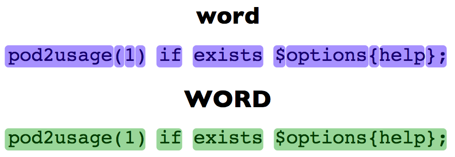

!SLIDE subsection

# movement #

!SLIDE bullets incremental

# Arrow keys #

* ← ↑ ↓ →
* h j k l

!SLIDE

# Disable arrow keys #

    @@@ vim
    map <up> <nop>
    map <down> <nop>
    map <left> <nop>
    map <right> <nop>

    imap <up> <nop>
    imap <down> <nop>
    imap <left> <nop>
    imap <right> <nop>

!SLIDE bullets incremental

# What is a word? #

* A **word** consists of a sequence of letters, digits and underscores, or a
sequence of other non-blank characters, separated with white space (spaces,
tabs, <EOL>).

* A **WORD** consists of a sequence of non-blank characters, separated with white
space.

!SLIDE center

# What is a word? #

!SLIDE bullets incremental

# Line jumping #

* w/W - word
* e/E - end
* b/B - beginning
* f/F - find
* t/T - till
* ;/, - repeat

!SLIDE center

# [demo] #
